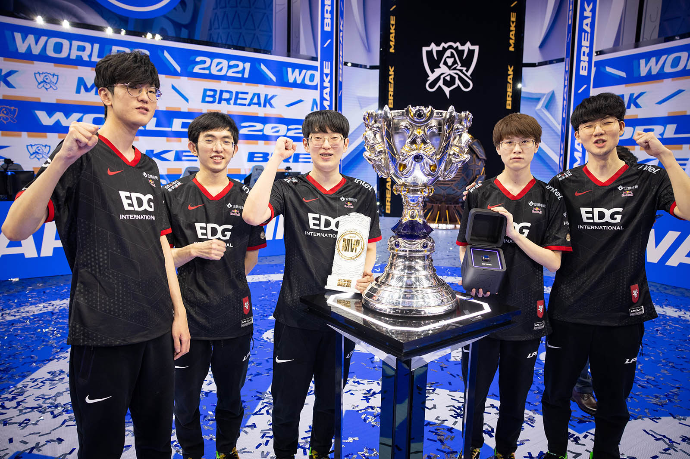

```{=html}
<style>
  body {
    font-family: "Times New Roman", Times, serif;
  }
</style>
```
```{r global_options, echo=FALSE}
knitr::opts_chunk$set(fig.height=3, fig.width=4, warning=FALSE, tidy=TRUE, tidy.opts=list(width.cutoff=60))

#needed packages:
library(dplyr)
library(ggplot2)
library(kableExtra)
library(tidyverse)
library(rvest)
library(stringr)
```

------------------------------------------------------------------------

# <font color="blue">**Introduction**</font>

Here is the link to the kaggle website [LOL 2021 Worlds Playin](https://www.sportsbusinessjournal.com/Esports/Sections/Media/2021/11/Worlds-2021-Finals-AMA.aspx).
Here is a link to the gol.gg website [Gol 2021 Worlds Playin](https://gol.gg/tournament/tournament-stats/World%20Championship%20Play-In%202021/). 

My dataset of league21.csv was collected from the official gol.gg website which contains all the Worlds tournament statistics since it's birth. Every year, many teams from around the world have to compete against each other in League of Legends in order to fight for a spot in the big tournament. This playin tournament shows who deserves to make it to the big stage and who should practice hard in order to make it to the next year. Many players get popular through these tournaments as fans cheer them on from many parts of the world. I picked this dataset because I have personally been playing League of Legends since I was in middle school. I loved how the game was very intuitive and had a lot of depth since you could learn many new techniques. By watching the pros in these playin tournaments or Worlds tournament, I could cheer on my favorite players and learn what they do and don't do in specific situations. Doing this will allow me to find success, win games, and have fun. I will be investigating whether a player's role in game affects their KDA, a player's kill affects their gold earned, a player's creep score affects their gold earned, player's assists affects their gold earned, and a player's kill participation being below or above a 50% threshold impacts their gold earned or assists amounted. 

  

*Here is the [Image Source](https://www.sportsbusinessjournal.com/Esports/Sections/Media/2021/11/Worlds-2021-Finals-AMA.aspx)*

# <font color="blue">**Data Preparation**</font>

First, I went to the kaggle website and downloaded the dataset.  The variable names were pretty clear and concise so I didn't need to rename it to a specific format. However, when I was creating the KDA column, some of the values were inf due to the fact that some players had 0 deaths. It is important to note that KDA is calculated by adding the kills and assists and then dividing it by the deaths. When you divide a number by 0, you get infinity. As a result, I had to use a loop to go through all the KDA column values and change the infinity values to NA. Afterwards, I made a new subset that had no NA values inside of it. There were no dates that I needed to work with. 
One challenge I faced was dealing with inf values since we had never learned about it in class. I always thought that dividing by zero would automatically make it NA but it actually makes it inf instead. I used the concept of loops to change them all to NA since I know how to work with NA values better.  

# <font color="blue">**Variable Descriptions**</font>

```{r fig.height=5, fig.width=7}
#reading files
league21 <- read.csv('2021league.csv')
#adding KDA column
league21 <- mutate(league21, KDA = (Kills + Assists) / Deaths)
#going through KDA column
for (i in 1:nrow(league21)) {
  # if that number is infinity, make it NA
  if (is.infinite(league21$KDA[i])) {
    league21$KDA[i] <- NA
  }
}
#make a halfkillpar column
league21$halfkillpar <- ifelse(league21$Kill.Participation >= 0.5, "yes", "no")
#remove all rows with na values
league21_no_na <- na.omit(league21)
```

```{r fig.height=5, fig.width=7}
#tibble with variables, types, descripitions of each
var_descriptions <- tibble(
  Name = c("Gold.Earned", "Kills", "Assists", "Deaths", "Creep.Score", "Kill.Participation", "Position", "KDA", "halfkillpar"),
  Type = c("Numerical", "Numerical", "Numerical", "Numerical", "Numerical", "Numerical", "Categorical", "Numerical", "Categorical"),
  Description = c(
    "Total gold earned by a player during the game",
    "Number of kills achieved by a player during the game",
    "Number of assists a player had during the game",
    "Number of deaths a player had during the game",
    "Creep score (minions/monsters killed) by a player during the game",
    "Proportion of team kills a player participated in",
    "Position or role of the player in the game (e.g., Jungle, Mid, ADC, etc.)",
    "Kill-Death-Assist ratio, calculated as (Kills + Assists) / Deaths",
    "Determining whether the Kill Participation of that player during the game is above or below 50%"
  )
)
var_descriptions
```

# <font color="blue">**Univariate Analyses**</font>

**[Variable of Gold Earned in 2021 Worlds Playin]**

```{r fig.height=5, fig.width=7}
#create histogram 
hist(league21$Gold.Earned,main='Histogram of Gold Earned in 2021 Worlds Playin',xlab='Gold Earned',ylab = 'Frequency',col='Blue')
#get mean of that column and round with 2 digits
round(mean(league21$Gold.Earned), digits=2)
# get sd of that column and round with 2 digits
round(sd(league21$Gold.Earned), digits = 2)
# get 5 number sum of that column and round with 2 digits
round(fivenum(league21$Gold.Earned), digits = 2)
```

The distribution of the histogram of gold earned versus its frequency is symmetrical. Therefore, I will use the mean of `r round(mean(league21$Gold.Earned), digits=2)` as the center measurement and the standard deviation of `r round(sd(league21$Gold.Earned), digits = 2)` as the spread measurement. Mean and standard deviation are used as the center measurement and spread measurement for symmetrical distributions because they are more affected by outliers and there are few outliers in a symmetrical distribution. Lastly, I printed the 5 number summary of minimum, Q1, median, Q3, and maximum in order to give more information about the graph.
Here is the 5 number summary: `r round(fivenum(league21$Gold.Earned), digits = 2)`

**[Variable of Kill Death Assist Ratio in 2021 Worlds Playin]**

```{r fig.height=5, fig.width=7}
#create histogram
hist(league21$KDA,main='Histogram of Kill Death Assist Ratio in 2021 Worlds Playin',xlab='KDA',ylab = 'Frequency',col='Blue',xlim=c(0,20))
#get median of that column and round with 2 digits
round(median(league21$KDA, na.rm = TRUE), digits=2)
# get IQR of that column and round with 2 digits
round(IQR(league21$KDA, na.rm = TRUE), digits = 2)
# get 5 number sum of that column and round with 2 digits
round(fivenum(league21$KDA, na.rm = TRUE), digits = 2)
```
The distribution of the histogram of KDA versus its frequency is right skewed. Therefore, I will use the median of `r round(median(league21$KDA, na.rm = TRUE), digits=2)` as the center measurement and the IQR of `r round(IQR(league21$KDA, na.rm = TRUE), digits = 2)` as the spread measurement. Median and IQR are used as the center measurement and spread measurement for skewed distributions because they are less affected by outliers and there are more outliers in a skewed distribution. Lastly, I printed the 5 number summary of minimum, Q1, median, Q3, and maximum in order to give more information about the graph.
Here is the 5 number summary: `r round(fivenum(league21$KDA), digits = 2)`

**[Variable of Creep / Minion Score in 2021 Worlds Playin]**

```{r fig.height=5, fig.width=7}
#create histogram 
hist(league21$Creep.Score,main='Histogram of Creep Score in 2021 Worlds Playin',xlab='Creep Score',ylab = 'Frequency',col='Blue')
#get median of that column and round with 2 digits
round(median(league21$Creep.Score), digits=2)
# get IQR of that column and round with 2 digits
round(IQR(league21$Creep.Score), digits = 2)
# get 5 number sum of that column and round with 2 digits
round(fivenum(league21$Creep.Score), digits = 2)
```
The distribution of the histogram of creep score versus its frequency is bimodal. Therefore, I will use the median of `r round(median(league21$Creep.Score), digits=2)` as the center measurement and the IQR of `r round(IQR(league21$Creep.Score), digits = 2)` as the spread measurement. Median and IQR are used as the center measurement and spread measurement for bimodal distributions because they are less affected by outliers and there are more extreme values in a bimodal distribution. Lastly, I printed the 5 number summary of minimum, Q1, median, Q3, and maximum in order to give more information about the graph.
Here is the 5 number summary: `r round(fivenum(league21$Creep.Score), digits = 2)`

**[Variable of Position in 2021 Worlds Playin]**

```{r fig.height=5, fig.width=7}
#create histogram 
barplot(table(league21$Position), main = 'Barplot of Role in 2021 Worlds Playin', xlab = 'Role', ylab = "Count", col = "lightblue", border = "red")
#freq and prop.table of position
freq_table <- table(league21$Position)
prop_table <- prop.table(freq_table)
freq_table
prop_table
```
The frequency table shows that each position has been chosen 44 times. Since they are all equal, this shows that there is a balanced distribution of role selections. The proportion table also shows that the 220 selections were eventually distributed between the roles since the percentages are all the same.

# <font color="blue">**Bivariate Analyses**</font>

**For each of your three predictors, create a graph to shows its bivariate relationship with the outcome variable. Calculate the relevant bivariate statistics and briefly describe the relationships between each predictor and your outcome, referencing your graphs.**

### **#1 Player's Position versus Kill Death Assist Ratio in 2021 Worlds Playin (Categorical Predictor Variable)**

```{r fig.height=5, fig.width=7}
boxplot(KDA ~ Position,
        data = league21_no_na,
        main = "Boxplot of Position / Role in Game vs Kill Death Assist Ratio",
        xlab = "Position / Role in Game",
        ylab = "KDA",
        col = "lightblue") 
```

This boxplot shows the Kill Death Assist Ratio number by a player's role in game. A higher KDA means that the player is performing better while a lower KDA means that the player is performing worse. The role ADC (Attack Damage Carry) usually kills a lot of champions while dying a small amount because their median KDA is higher. On the other hand, the jungle and mid role have lower median KDAs meaning that they usually kill a smaller amount of champions and die a larger amount. Furthermore, jungle and ADC roles have the highest IQR meaning that they have the most variability in KDA. On the other hand, the mid role has the lowest IQR meaning it has the least variability in KDA. Because the mid role has a pretty low median and IQR, it is safe to assume that this role probably doesn't kill or assist many champions and dies pretty often.

### **#2 Player's Amount of Kills versus Gold Earned in 2021 Worlds Playin (Numerical Predictor Variable)**

The next two bivariate analyses use the term correlation coefficient to describe the relationship between the variables. Here is a wikipedia page to learn more about it and it's uses! [Pearson correlation coefficient](https://en.wikipedia.org/wiki/Pearson_correlation_coefficient)

```{r fig.height=5, fig.width=7}
#scatterplot
plot(league21$Kills,league21$Gold.Earned,main='Amount of Kills versus Gold Earned',xlab='Amuont of Kills',ylab='Gold Earned',pch=20)
# find correlation coefficient which describes how correlated the two vars are
round(cor(league21$Kills,league21$Gold.Earned),digits = 2)
```

The player's amount of kills is related to their gold earned in 2021 Worlds Playin. There is a correlation coefficient of `r round(cor(league21$Kills,league21$Gold.Earned),digits = 2)` between the player's amount of kills versus gold earned. Since this number is between 0.7 and 0.8, there is a strong linear relationship between the two variables. Also, there is a positive relationship between the two variables because the correlation coefficient is positive. This would imply that players with a high amount of kills tend to have a higher amount of gold earned in the 2021 Worlds Playin. 

### **#3 Player's Creep / Minion Score versus Gold Earned in 2021 Worlds Playin (Numerical Predictor Variable)**

```{r fig.height=5, fig.width=7}
#scatterplot
plot(league21$Creep.Score,league21$Gold.Earned,main='Creep Score versus Gold Earned',xlab='Creep Score',ylab='Gold Earned',pch=20)
# find correlation coefficient which describes how correlated the two vars are
round(cor(league21$Creep.Score,league21$Gold.Earned),digits = 2)
```

A player's creep score is related to amount of gold earned in the 2021 Worlds Playin. There is a correlation coefficient of `r round(cor(league21$Creep.Score,league21$Gold.Earned),digits = 2)` between these two variables. Since this number is above 0.7, there is a strong relationship between the two variables. Also, there is a positive relationship between the two variables because the correlation coefficient is positive. This would imply that players with a higher creep score tend to have a higher amount of gold earned.

### **#4 Multivariate Plot: Player's Assists versus Gold Earned by Kill Participation Being Above or Below Half**

```{r fig.height=5, fig.width=7}

#if that point has a halfkillpar of yes, make it blue, if not red
colors_halfkill <- ifelse(league21$halfkillpar == "yes", "blue", "red")

#scatterplot
plot(league21$Assists, league21$Gold.Earned, 
     xlab = "Assists", 
     ylab = "Gold Earned", 
     main = "Assists vs Gold Earned",
     #color code by Kill Participation 
     col = colors_halfkill,
     pch = 19)  
# Add a legend for what each of the colors mean in terms of halfkillpar
legend("topright", 
       legend = c("Above or Equal", "Below"), 
       col = c("blue", "red"), 
       pch = 19, 
       title = "Kill Participation")
round(cor(league21$Assists,league21$Gold.Earned),digits = 2)
```

The player's amount of assists is related to their gold earned in 2021 Worlds Playin. There is a correlation coefficient of `r round(cor(league21$Assists,league21$Gold.Earned),digits = 2)` between the player's amount of kills versus gold earned. Since this number is close to 0, there is a weak linear relationship between the two variables. Also, there is a positive relationship between the two variables because the correlation coefficient is positive. This would imply that players with a high amount of assists tend to have a higher amount of gold earned in the 2021 Worlds Playin. The scatterplot shows that assists and gold earned don't have a consistent relationship due to the points being pretty scattered. Also, the color coded points representing the kill participation are pretty consistent. We see that players with a higher kill participation tend to have a higher assists and gold earned amount. On the other hand, players with a lower kill participation have lower gold earned amounts and lower assists amounts. 

# <font color ="blue">**Reproducibility Resources**</font>

[Github Repository Link](https://github.com/antzha630/Project2)
Inside this github repository, it has the picture Worlds2021 that is needed to run this R markdown, the R markdown file, the html file, and the read me. . 

# <font color ="blue">**Choice Elements**</font>

The elements that I used are A, D, E, I, and J.\
A. I used in-line codes when I was outputting the mean, standard deviation, median, IQR, and five number summary for many of the univariate distributions. Also, I used it to output the correlation coefficients for the bivariate scatterplots.\
D. I created two new variables in my dataset called halfkillpar and KDA. Halfkillpar is a categorical variable that says yes if the kill participation of that player is above or equal to 50% and no if it below 50%. KDA is the (kills + assists) / deaths. Kill participation, kills, assists, and deaths were variables that were originally in the dataset. \
E. I managed the NA values of the new variable of KDA. Initially when I created the KDA column, some of the values were inf due to dividing by zero. However, I used a for loop to convert them to NA and then used na.omit to remove them all. \
I. I used a for loop in order to go through the entire KDA column. This for loop has a time complexity of O(n) which is pretty efficient for the smaller input size. Using a R command to do this would have the same time complexity. \
J. I used an if statement inside of the above for loop in order to check if the specific number in the KDA column is inf. If it is inf, it will make it to a NA value since it is easier to work with that. Also, I used some ifelse statements when trying to color code the multivariate plot by halfkillpar. I could easily see which players had a high or low kill participation just based on the color. 

# <font color = "blue"> **Conclusion**</font>

**Write a conclusion that summarizes your analysis findings and suggests areas for future research. Include all references for your report at the bottom.**

I found that players in the ADC role had the highest KDA showing that they usually killed many champions while surviving. However, the mid role had a low KDA value meaning that they usually had a low amount of kills and assists while having a larger amount of deaths. Also, there is a strong linear relationship between kills and gold earned. This shows that it is important to get kills in order to earn more gold in matches. There is a strong positive relationship between a player's creep score and gold earned. Being able to farm minions consistently in matches will also lead to resource gain. Lastly, players on the higher end of kill participation tended to have more assists and gold while players on the lower end of kill participation tended to have less assists and gold.  
This suggests that higher kill participation might be associated with earning more gold, which aligns with the idea that players who contribute more actively (either in kills or assists) tend to accumulate more resources.

In the future, I could research other factors like team chemistry, in-game itemization, synergy, playstyles, and more. Furthermore, seeing the statistics of players across their entire career and not just the 2021 Worlds Playin could give more helpful data. Lastly, I could even delve into the statistics of players from different elos like silver, bronze, gold, diamond, and much more since different players of different skill levels might play differently. 

# <font color = "blue"> **References Used:**\
[Pearson correlation coefficient](https://en.wikipedia.org/wiki/Pearson_correlation_coefficient)\
[Multivariate Plots](https://pjbartlein.github.io/GeogDataAnalysis/lec05.html)\
[Worlds2021 Picture](https://www.sportsbusinessjournal.com/Esports/Sections/Media/2021/11/Worlds-2021-Finals-AMA.aspx)\
[LOL 2021 Worlds Playin](https://www.sportsbusinessjournal.com/Esports/Sections/Media/2021/11/Worlds-2021-Finals-AMA.aspx)\
[Gol 2021 Worlds Playin](https://gol.gg/tournament/tournament-stats/World%20Championship%20Play-In%202021/)\
[Github Repository Link](https://github.com/antzha630/Project2)\

------------------------------------------------------------------------
